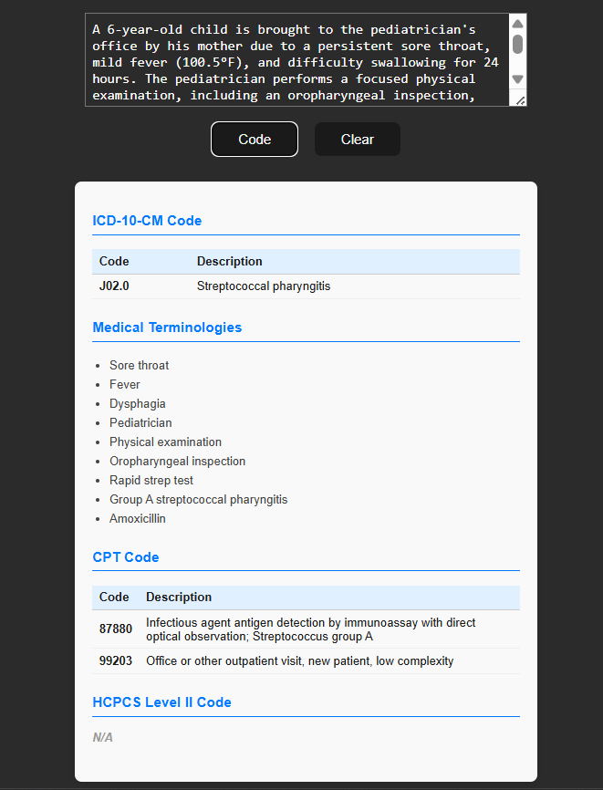

# Medical Coding Assistant

A smart web application that leverages **Google Gemini** to automatically extract standardized **medical codes** and **clinical terminologies** from free-text patient scenarios. It helps healthcare professionals, students, and medical coders map clinical information to:

* ✅ **ICD-10-CM Codes** (Diagnosis)
* ✅ **CPT Codes** (Procedures)
* ✅ **HCPCS Level II Codes**
* ✅ Relevant **Medical Terminologies**

**Live Site:** [https://medical-coding-assist.vercel.app/](https://medical-coding-assist.vercel.app/)

**Repository:** [GitHub - Nithinbharathi93/medical-coding-assist](https://github.com/Nithinbharathi93/medical-coding-assist)

> **Note:** This is not an open-source project. The code is private and proprietary.

---

## ✨ Features

* **AI-powered NLP** with Google Gemini Flash 2.0
* Outputs structured JSON with:

  * ICD-10-CM diagnostic codes
  * CPT procedural codes
  * HCPCS Level II codes
  * Key medical terms
* 🧼 Minimalist UI with instant results and reset functionality
* ⚡ Built with React + Vite

---

## 📸 Example



### 🔤 Input

```
A 6-year-old child is brought to the pediatrician's office by his mother due to a persistent sore throat, mild fever (100.5°F), and difficulty swallowing for 24 hours. The pediatrician performs a focused physical examination, including an oropharyngeal inspection, and orders a rapid strep test, which comes back positive. The diagnosis is Group A streptococcal pharyngitis, and amoxicillin is prescribed. This is a new patient to the practice.
```

### 📤 Output

```json
{
  "ICD-10-CM Code": {
    "J02.0": "Streptococcal pharyngitis"
  },
  "Medical Terminologies": [
    "Sore throat",
    "Fever",
    "Dysphagia",
    "Pediatrician",
    "Physical examination",
    "Oropharyngeal inspection",
    "Rapid strep test",
    "Group A streptococcal pharyngitis",
    "Amoxicillin"
  ],
  "CPT Code": {
    "99203": "Office or other outpatient visit, new patient, low complexity",
    "87880": "Rapid strep test"
  },
  "HCPCS Level II Code": "N/A"
}
```

---

## 🚀 Getting Started

### 📦 Requirements

* Node.js v18+
* Google Generative AI API Key ([get it here](https://makersuite.google.com/app))

### 🔧 Setup

```bash
git clone https://github.com/Nithinbharathi93/medical-coding-assist.git
cd medical-coding-assist
npm install
```

### ▶️ Run

```bash
npm run dev
```

---

## 🧠 How It Works

* Accepts clinical scenarios as plain text
* Uses Gemini Flash with a tailored system prompt
* Parses AI response into a structured JSON object
* Displays medical codes and terminology in a clean UI

---

## 📁 Tech Stack

* React (Vite)
* Google Generative AI (Gemini Flash 2.0)
* CSS + Responsive Layout
* Private, not open source

---

## 📌 Use Cases

* Clinical coding education
* Insurance/billing assistance
* Automated documentation support
* Data preprocessing for medical NLP research

---

## 📃 License & Access

This project is **proprietary** and **not open-source**.
For demo access or collaboration requests, please reach out via [GitHub](https://github.com/Nithinbharathi93).

---


## 🧑‍💻 Author

**Nithinbharathi T**
[GitHub](https://github.com/nithinbharathi93) | [LinkedIn](https://linkedin.com/in/nithinbharathi)

---

